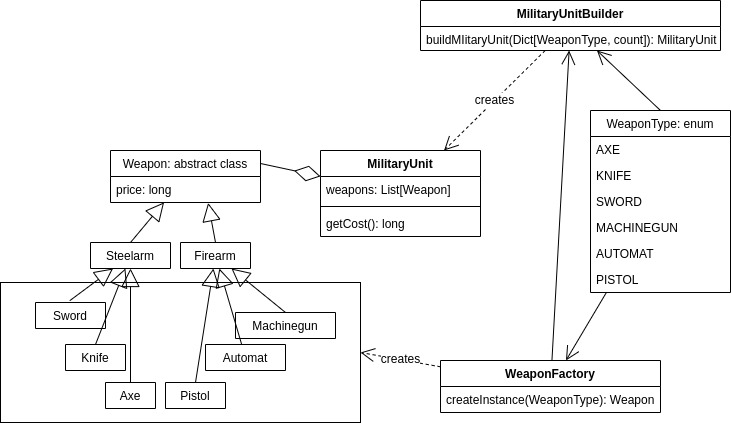
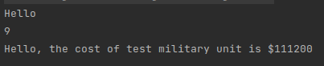

# Лабораторная работа 1: Структурные паттерны.

Оружие. Определить иерархию оружия (холодного и огнестрельного). Вооружить военное подразделение. Посчитать стоимость.

Factroty method — это порождающий паттерн проектирования, который определяет общий интерфейс для создания объектов в суперклассе, позволяя подклассам изменять тип создаваемых объектов.

## Диаграмма классов

## Пример работы программы
