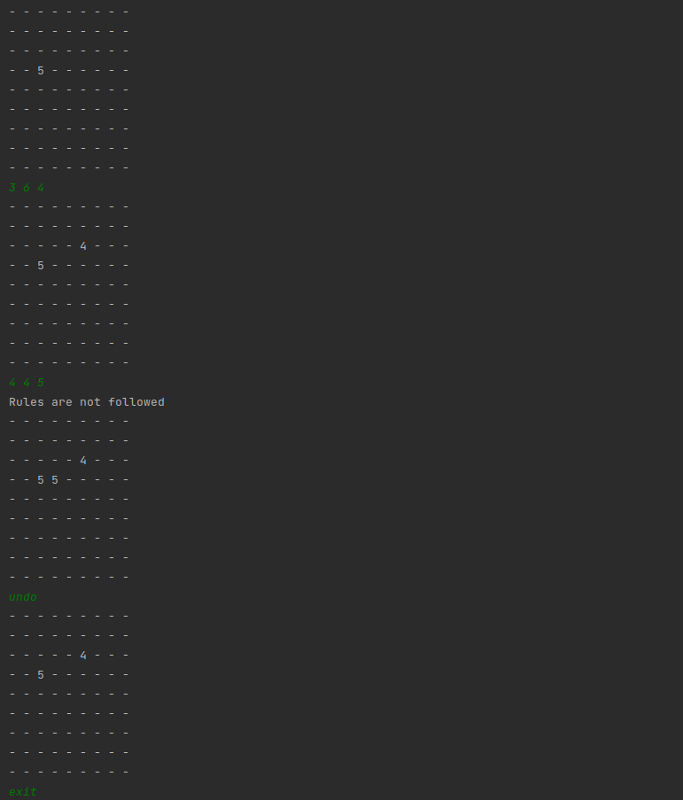

# Лабораторная работа 3: Поведенческие паттерны.

Паттерн Memento. Реализовать алгоритм игры судоку. Реализовать возможность «взять назад ход».

Memento — это поведенческий паттерн проектирования, который позволяет сохранять и восстанавливать прошлые состояния объектов, не раскрывая подробностей их реализации.

## Пример работы программы
